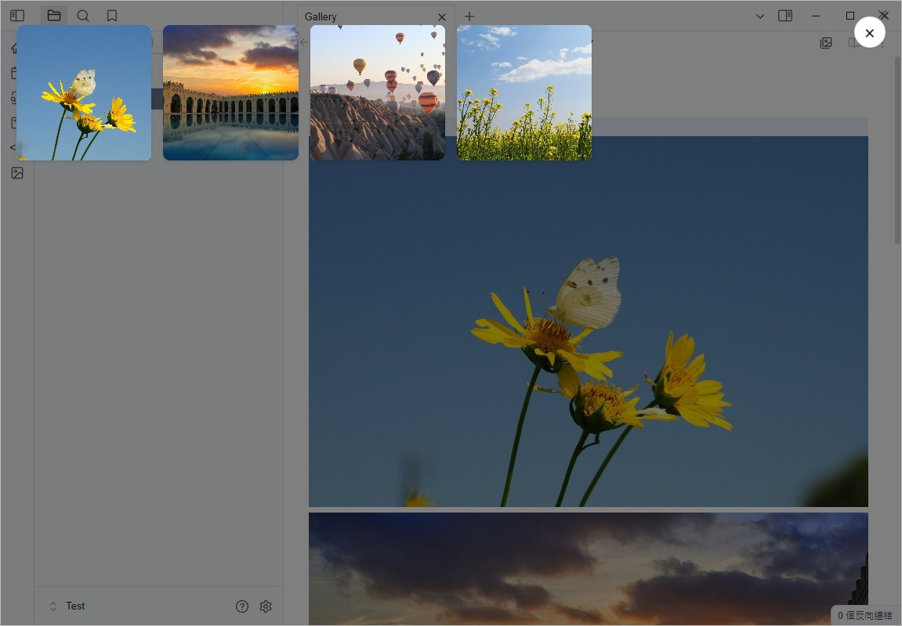
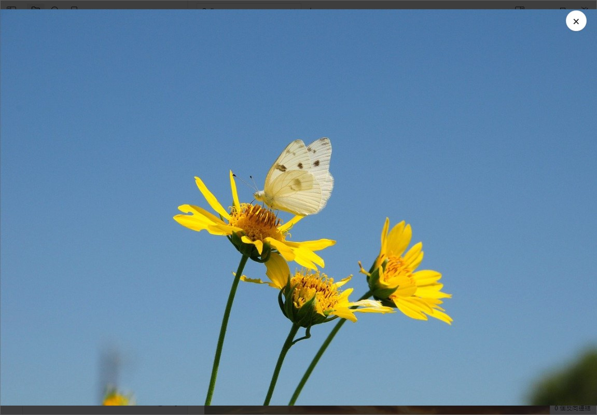
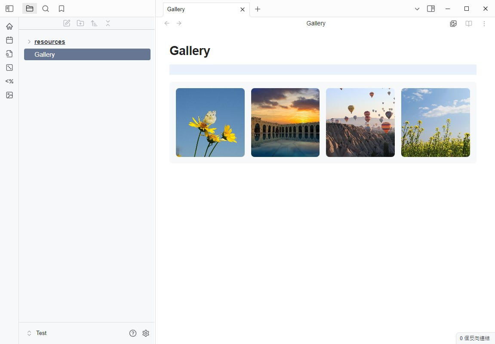

# Obsidian Media Viewer

[繁體中文](README_zhTW.md) | English

## Introduction

Media Viewer is a plugin designed for Obsidian, aiming to provide an intuitive media browser that allows users to easily view media files (such as images and videos) within their notes.




## Features

- **Media Browser**: View all media files in a note in full-screen mode.
- **Click to Open Media**: Open the media browser by clicking on an image.
- **Create Gallery Block**: Create a media gallery block to display multiple media files in a grid format within a note.

## Installation

1. Download the latest version of this plugin.
2. Place the plugin folder in Obsidian's plugin directory.
3. Enable this plugin in Obsidian.

## Usage

- Open a note and use the command palette (`Ctrl + P`) to select "Open Media Viewer" to view media files within the note.
- Click on media thumbnails to view full-screen previews.
- Use keyboard arrow keys to switch between media files.

### Gallery Block Usage



You can create a Gallery block in a note using the following format:

```markdown
```gallery
![[image1.jpg]]
![[image2.jpg]]
![[image3.jpg]]
![[video.mp4]]
[[note]]
```

#### Gallery Additional Parameters

| Attribute | Description |
| :----- | :-------------------------------- |
| title: | Set the title of the Gallery |
| addButton: `true or false` | Whether to display the add image button     |
| alt: | Add a description above an image |
| img: | Display a thumbnail using `![image.jpg]` above a note |


```markdown
```gallery
addButton: true
title: gallery
alt: image1
![[image1.jpg]]
alt: image2
![[image2.jpg]]
alt: image3
![[image3.jpg]]
![[video.mp4]]
img: ![[image4.jpg]]
[[note]]
```

## Settings

In the plugin's settings page, you can customize the following options:

- Allow deletion of media files
- Auto-open the first image
- Open media browser when clicking on an image
- Adjust the Gallery Grid layout width

## License

This plugin follows the [MIT License](LICENSE).