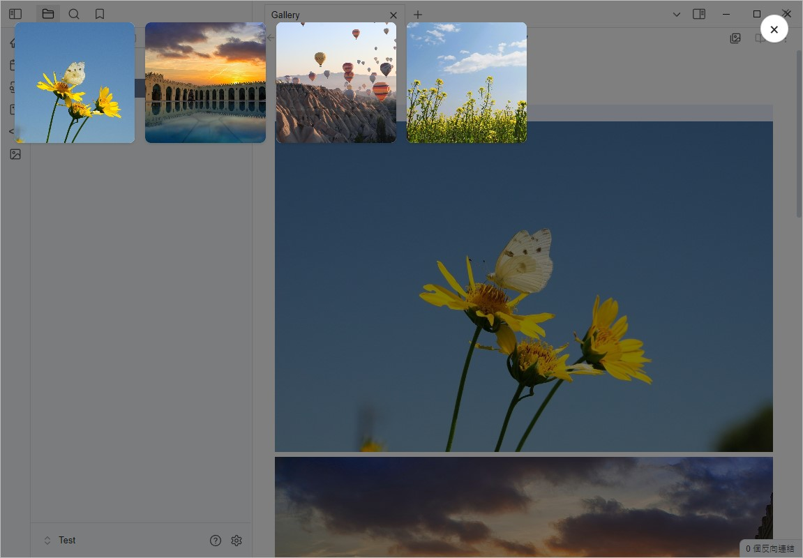
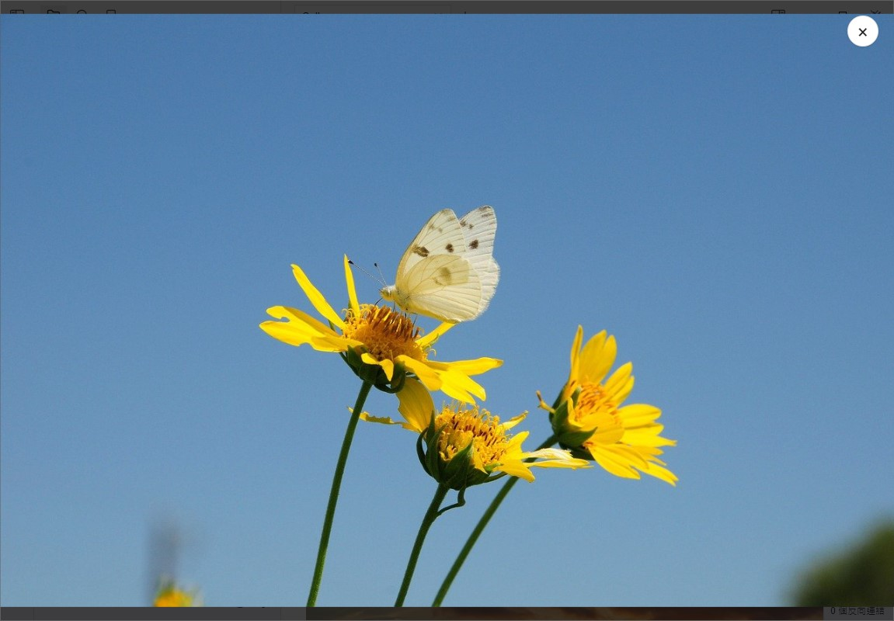
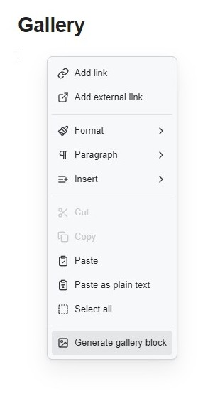
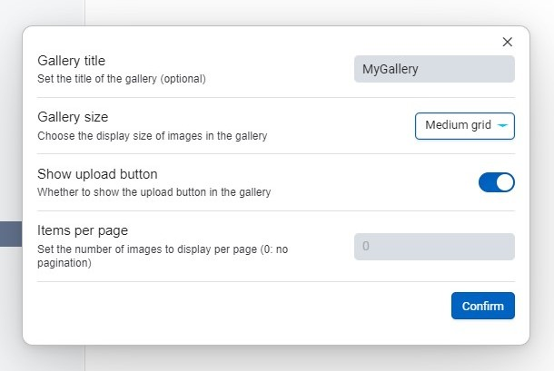
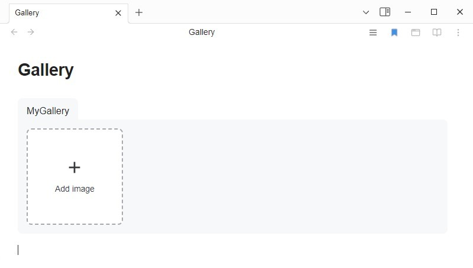

# Media Viewer

[English](README.md) | 日本語 | [中文](README_zhTW.md)

## はじめに

Media Viewerは、Obsidian用に設計されたプラグインで、ノート内のメディアファイル（画像や動画など）を簡単に閲覧できる直感的なメディアブラウザを提供することを目的としています。




## 機能

- **メディアブラウザ**：ノート内のすべてのメディアファイルをフルスクリーンモードで表示します。
- **クリックでメディアを開く**：画像をクリックしてメディアブラウザを開くことができます。
- **ギャラリーブロックの作成**：メディアギャラリーブロックを作成して、ノート内に複数のメディアファイルをグリッド形式で表示できます。

## インストール

1. このプラグインの最新バージョンをダウンロードします。
2. プラグインフォルダをObsidianのプラグインディレクトリに配置します。
3. Obsidianでこのプラグインを有効にします。

## 使用方法

- ノートを開き、コマンドパレット（`Ctrl + P`）を使用して「Open Media Viewer」を選択し、ノート内のメディアファイルを表示します。
- メディアのサムネイルをクリックして、フルスクリーンプレビューを表示します。
- キーボードの矢印キーを使用して、メディアファイル間を切り替えます。

### ギャラリーブロックの使用方法


以下の形式を使用して、ノート内にギャラリーブロックを作成できます：

````markdown
```gallery
![[image1.jpg]]
![[image2.jpg]]
![[image3.jpg]]
![[video.mp4]]
[[note]]
```
````

### コマンドを使用したギャラリーブロックの作成





作成後、画像をブロックに直接ドラッグ＆ドロップして追加できます。

#### ギャラリーの追加パラメータ

| 属性 | 説明 |
| :----- | :-------------------------------- |
| title: `テキストまたは[[リンク]]` | ギャラリーのタイトルを設定するために使用 |
| size: `small または medium または large` | ギャラリーのサムネイルサイズ |
| addButton: `true または false` | 画像追加ボタンを表示するかどうか |
| pagination: `数字` | ギャラリー内の画像数がこの数を超えると、ページネーションを表示 |
| alt: `テキストまたは[[リンク]]`  | 画像リンクの上の行に配置し、画像の説明として機能 |
| img: `image.jpg または ![[image.jpg]]`  | ノートリンクの上の行に配置し、サムネイルとして表示 |


````markdown
```gallery
size: small
addButton: true
title: gallery

alt: image1
![[image1.jpg]]

alt: image2
![[image2.jpg]]

alt: image3
![[image3.jpg]]

![[video.mp4]]

img: image4.jpg
[[note]]
```
````

## 設定

プラグインの設定ページでは、以下のオプションをカスタマイズできます：

- メディアファイルの削除を許可するかどうか
- 最初の画像を自動的に開くかどうか
- 画像をクリックしたときにメディアブラウザを開くかどうか
- ギャラリーグリッドレイアウトの幅を調整する

## ライセンス

このプラグインは[MIT License](LICENSE)に従います。
