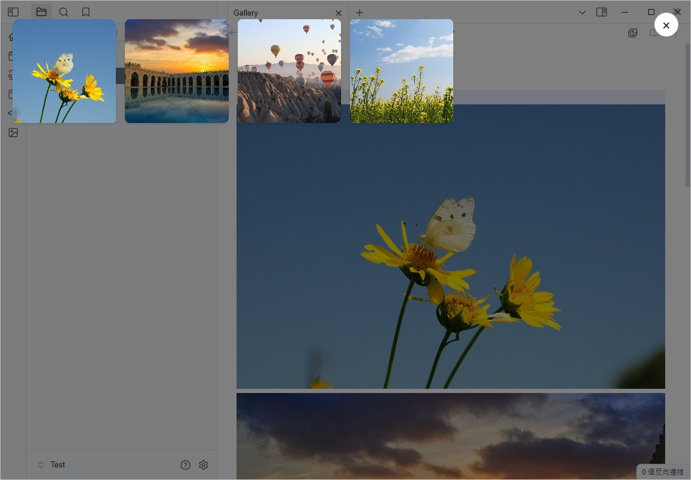
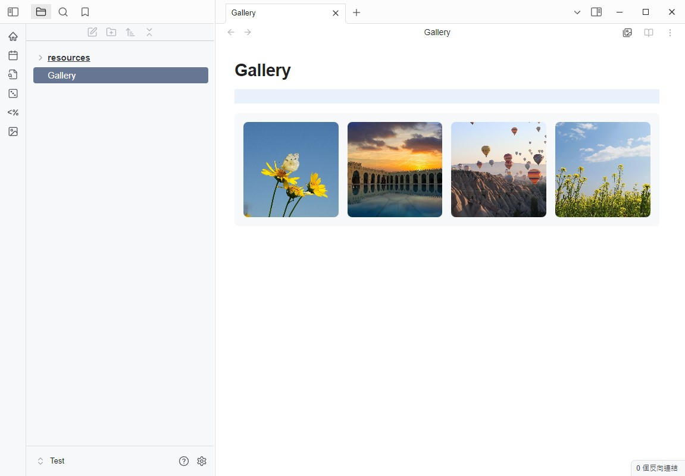
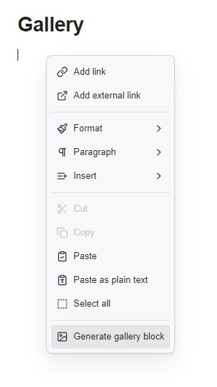
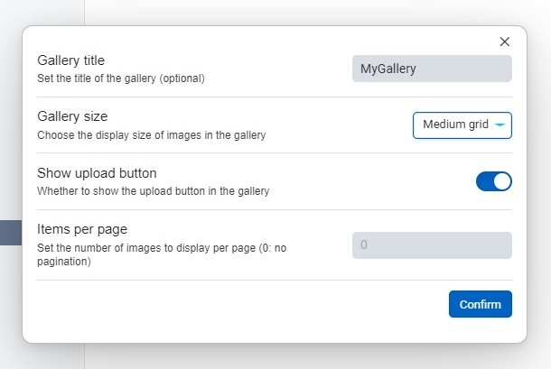
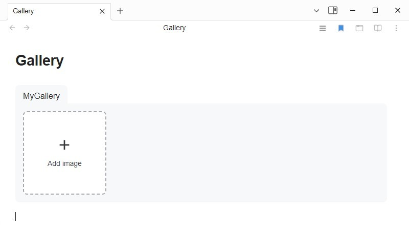

# Media Viewer

[English](README.md) | [日本語](README_ja.md) | 中文

## 介紹

Media Viewer 是一個為 Obsidian 設計的插件，旨在提供一個直觀的媒體瀏覽器，使用戶能夠輕鬆查看筆記中的媒體文件（如圖片和視頻）。



## 功能

- **媒體瀏覽器**：可以在全屏模式下查看筆記中的所有媒體文件。
- **點擊打開媒體**：可以通過點擊圖片來打開媒體瀏覽器。
- **建立 Gallery 區塊**：可以創建媒體的 gallery 區塊，以便在筆記中以網格形式顯示多個媒體文件。

## 安裝

1. 下載此插件的最新版本。
2. 將插件文件夾放入 Obsidian 的插件目錄中。
3. 在 Obsidian 中啟用此插件。

## 使用

- 打開一個筆記，然後使用命令面板（`Ctrl + P`）選擇 "Open Media Viewer" 來查看筆記中的媒體文件。
- 點擊媒體縮圖以查看全屏預覽。
- 使用鍵盤箭頭鍵在媒體之間切換。


## Gallery 區塊用法



您可以使用以下格式在筆記中創建 Gallery 區塊：

````markdown
```gallery
![[image1.jpg]]
![[image2.jpg]]
![[image3.jpg]]
![[video.mp4]]
[[note]]
```
````

### Gallery 額外參數

| 屬性     | 說明                                |
| :----- | :-------------------------------- |
| title: `文字 or [[連結]]` | 用於設置 Gallery 的標題                  |
| size: `small or medium or large` | Gallery 的縮圖尺寸 |
| addbutton: `true or false` | 是否顯示新增圖片按鈕                  |
| pagination: `數字` | Gallery 的圖片大於幾張時以分頁顯示 |
| alt: `文字 or [[連結]]`  | 放在圖片連結的上一行，可作為圖片的說明                 |
| img: `image.jpg or ![[image.jpg]]`  | 放在筆記連結的上一行，可顯示為縮圖 |

````markdown
```gallery
title: gallery
size: small
addButton: true
pagination: 10

alt: image1
![[image1.jpg]]

alt: image2
![[image2.jpg]]

alt: image3
![[image3.jpg]]

![[video.mp4]]

img: image4.jpg
[[note]]
```
````

### 使用命令建立 Gallery 區塊





建立完成之後可以將圖片直接拖曳到區塊中新增


## 設定

在插件的設定頁面中，您可以自定義以下選項：

- 是否允許刪除媒體文件
- 是否自動打開第一張圖片
- 點擊圖片時是否打開媒體瀏覽器
- 調整 Gallery Grid 佈局寬度


## 授權

此插件遵循 [MIT License](LICENSE)。